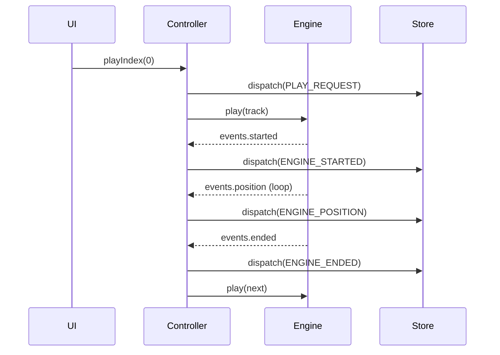

# Diagrama de secuencia de eventos

```mermaid
sequenceDiagram
  participant UI
  participant Controller
  participant Engine
  participant Store

  UI->>Controller: playIndex(0)
  Controller->>Store: dispatch(PLAY_REQUEST)
  Controller->>Engine: play(track)
  Engine-->>Controller: events.started
  Controller->>Store: dispatch(ENGINE_STARTED)
  Engine-->>Controller: events.position (loop)
  Controller->>Store: dispatch(ENGINE_POSITION)
  Engine-->>Controller: events.ended
  Controller->>Store: dispatch(ENGINE_ENDED)
  Controller->>Engine: play(next)
```
