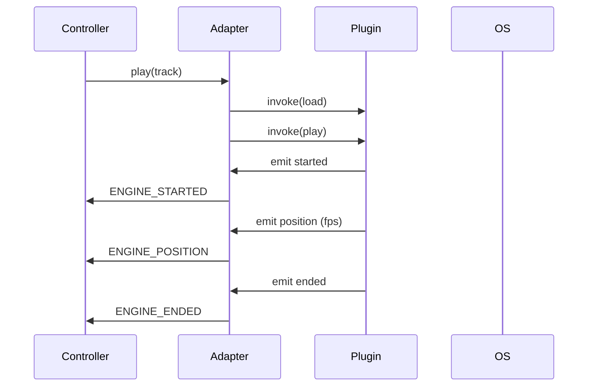

# Motor Nativo Tauri (Rust)

## Flujo de Eventos

## Comparación WebView vs Nativo

- WebView:
  - Pros: simplicidad, soporte inmediato MP3/AAC
  - Contras: latencia mayor, formatos limitados, seek dependiente del navegador
- Nativo:
  - Pros: baja latencia, formatos avanzados (MP3, WAV, FLAC, OGG), control preciso
  - Contras: mayor complejidad, depende de backend nativo

## Cuándo usar cada engine

- WebView: prototipos, apps livianas, requisitos simples
- Nativo: producción, formatos avanzados, baja latencia, control fino (seek, gapless, crossfade)

## Notas de rendimiento y extensibilidad

- Decodificación: `symphonia` para soporte multi-formato y cálculo de duración
- Salida: `rodio` sobre `cpal` para control de volumen y pausas
- Seek: reposicionamiento recreando `Sink` desde offset; para streams, usar decoder con seek
- Gapless/Crossfade: doble buffer y mezclas controladas en la capa nativa
